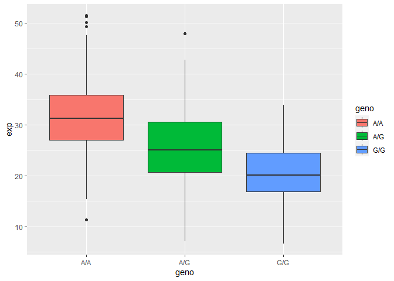

# Class 12: Population Scale Analysis
Clarissa Savko (PID: A69028482)

Q13: Read this file into R and determine the sample size for each
genotype and their corresponding median expression levels for each of
these genotypes.

``` r
pop <- read.table("rs8067378_ENSG00000172057.6.txt")
head(pop)
```

       sample geno      exp
    1 HG00367  A/G 28.96038
    2 NA20768  A/G 20.24449
    3 HG00361  A/A 31.32628
    4 HG00135  A/A 34.11169
    5 NA18870  G/G 18.25141
    6 NA11993  A/A 32.89721

``` r
nrow(pop)
```

    [1] 462

``` r
table(pop$geno)
```


    A/A A/G G/G 
    108 233 121 

108 have the A/A genotype, 233 have A/G, and 121 have G/G.

``` r
library(dplyr)
```


    Attaching package: 'dplyr'

    The following objects are masked from 'package:stats':

        filter, lag

    The following objects are masked from 'package:base':

        intersect, setdiff, setequal, union

``` r
pop %>%
  group_by(geno) %>%
  summarize(avg_exp = mean(exp))
```

    # A tibble: 3 × 2
      geno  avg_exp
      <chr>   <dbl>
    1 A/A      31.8
    2 A/G      25.4
    3 G/G      20.6

The average expression of the A/A genotype is 31.82, A/G genotype is
25.40, and G/G is 20.60.

Q14: Generate a boxplot with a box per genotype, what could you infer
from the relative expression value between A/A and G/G displayed in this
plot? Does the SNP effect the expression of ORMDL3?

``` r
library(ggplot2)
ggplot(pop) + aes(geno, exp, fill=geno) + 
  geom_boxplot()
```



It appears that the G/G SNP decreases expression of the gene.
