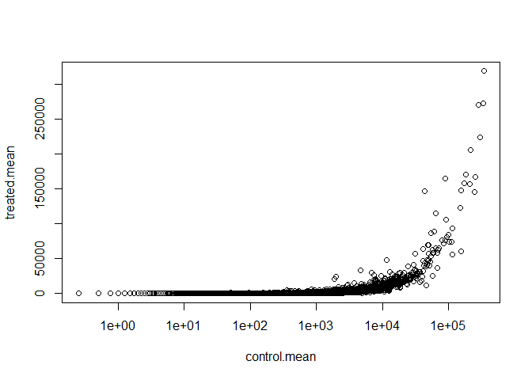
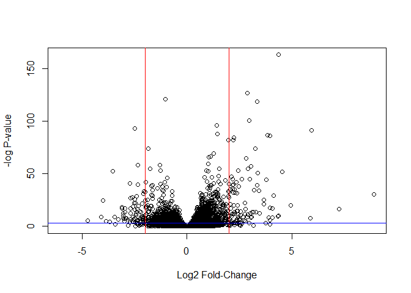
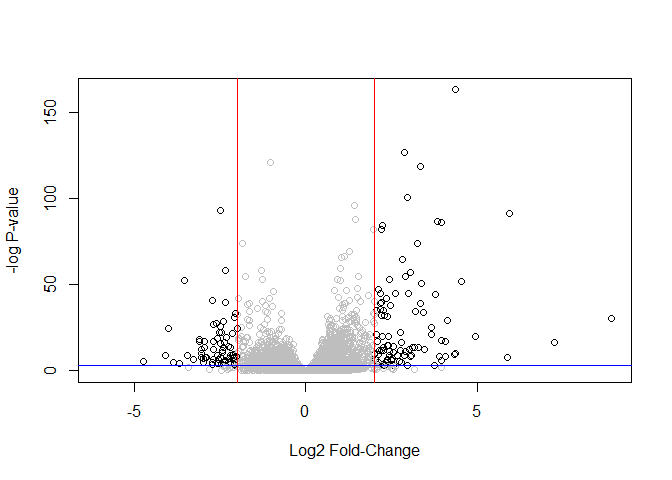

# Class 13: RNASeq Analysis with DESeq2
Clarissa Savko (PID: A69028482)

The data for this hands-on session comes from a published RNA-seq
experiment where airway smooth muscle cells were treated with
dexamethasone, a synthetic glucocorticoid steroid with anti-inflammatory
effects (Himes et al. 2014).

``` r
library(DESeq2)
```

    Warning: package 'GenomeInfoDb' was built under R version 4.3.2

    Warning: package 'matrixStats' was built under R version 4.3.2

``` r
counts <- read.csv("airway_scaledcounts.csv", row.names = 1)
metadata <- read.csv("airway_metadata.csv")
```

Q1. How many genes are in this dataset?

``` r
head(counts)
```

                    SRR1039508 SRR1039509 SRR1039512 SRR1039513 SRR1039516
    ENSG00000000003        723        486        904        445       1170
    ENSG00000000005          0          0          0          0          0
    ENSG00000000419        467        523        616        371        582
    ENSG00000000457        347        258        364        237        318
    ENSG00000000460         96         81         73         66        118
    ENSG00000000938          0          0          1          0          2
                    SRR1039517 SRR1039520 SRR1039521
    ENSG00000000003       1097        806        604
    ENSG00000000005          0          0          0
    ENSG00000000419        781        417        509
    ENSG00000000457        447        330        324
    ENSG00000000460         94        102         74
    ENSG00000000938          0          0          0

``` r
nrow(counts)
```

    [1] 38694

There are 38694 genes.

Q2. How many ‘control’ cell lines do we have?

``` r
sum(metadata$dex=="control")
```

    [1] 4

``` r
table(metadata$dex)
```


    control treated 
          4       4 

There are 4 control cell lines.

``` r
head(counts)
```

                    SRR1039508 SRR1039509 SRR1039512 SRR1039513 SRR1039516
    ENSG00000000003        723        486        904        445       1170
    ENSG00000000005          0          0          0          0          0
    ENSG00000000419        467        523        616        371        582
    ENSG00000000457        347        258        364        237        318
    ENSG00000000460         96         81         73         66        118
    ENSG00000000938          0          0          1          0          2
                    SRR1039517 SRR1039520 SRR1039521
    ENSG00000000003       1097        806        604
    ENSG00000000005          0          0          0
    ENSG00000000419        781        417        509
    ENSG00000000457        447        330        324
    ENSG00000000460         94        102         74
    ENSG00000000938          0          0          0

I want to compare the control to the treated columns. To do this I
will: 1) Identify and extract the “control” columns 2) Calculate the
mean value per gene for all of these “control” columns and save as
`control.mean` 3) Repeat for the “treated” columns 4) Compare
`control.mean` vs. `treated.mean`

Step 1:

``` r
control.inds <- metadata$dex=="control"
```

``` r
metadata[control.inds,]
```

              id     dex celltype     geo_id
    1 SRR1039508 control   N61311 GSM1275862
    3 SRR1039512 control  N052611 GSM1275866
    5 SRR1039516 control  N080611 GSM1275870
    7 SRR1039520 control  N061011 GSM1275874

``` r
head(counts[,control.inds])
```

                    SRR1039508 SRR1039512 SRR1039516 SRR1039520
    ENSG00000000003        723        904       1170        806
    ENSG00000000005          0          0          0          0
    ENSG00000000419        467        616        582        417
    ENSG00000000457        347        364        318        330
    ENSG00000000460         96         73        118        102
    ENSG00000000938          0          1          2          0

Step 2:

``` r
control.mean <- rowMeans(counts[,control.inds])
head(control.mean)
```

    ENSG00000000003 ENSG00000000005 ENSG00000000419 ENSG00000000457 ENSG00000000460 
             900.75            0.00          520.50          339.75           97.25 
    ENSG00000000938 
               0.75 

Step 3:

``` r
treated.inds <- metadata$dex=="treated"
treated.inds
```

    [1] FALSE  TRUE FALSE  TRUE FALSE  TRUE FALSE  TRUE

``` r
metadata[treated.inds,]
```

              id     dex celltype     geo_id
    2 SRR1039509 treated   N61311 GSM1275863
    4 SRR1039513 treated  N052611 GSM1275867
    6 SRR1039517 treated  N080611 GSM1275871
    8 SRR1039521 treated  N061011 GSM1275875

``` r
head(counts[,treated.inds])
```

                    SRR1039509 SRR1039513 SRR1039517 SRR1039521
    ENSG00000000003        486        445       1097        604
    ENSG00000000005          0          0          0          0
    ENSG00000000419        523        371        781        509
    ENSG00000000457        258        237        447        324
    ENSG00000000460         81         66         94         74
    ENSG00000000938          0          0          0          0

Q3. How would you make the above code in either approach more robust? Is
there a function that could help here?

Using mean rather than manually dividing by the total number of values
is a more robust way to avoid making mistakes or finding the total of
large sample group.

Q4. Follow the same procedure for the treated samples (i.e. calculate
the mean per gene across drug treated samples and assign to a labeled
vector called treated.mean)

``` r
treated.mean <- rowMeans(counts[,treated.inds])
head(treated.mean)
```

    ENSG00000000003 ENSG00000000005 ENSG00000000419 ENSG00000000457 ENSG00000000460 
             658.00            0.00          546.00          316.50           78.75 
    ENSG00000000938 
               0.00 

Let’s combine our meancount data for bookkeeping purposes.

``` r
mean.counts <- data.frame(control.mean, treated.mean)
```

Let’s see what these count values look like…

Q5 (a). Create a scatter plot showing the mean of the treated samples
against the mean of the control samples. Your plot should look something
like the following.

``` r
plot(mean.counts)
```


Q5 (b).You could also use the ggplot2 package to make this figure
producing the plot below. What geom\_?() function would you use for this
plot? geom_point()

``` r
library(ggplot2)
ggplot(mean.counts) +
  aes(control.mean, treated.mean) +
  geom_point(alpha=0.2)
```


``` r
plot(mean.counts, log="x")
```

    Warning in xy.coords(x, y, xlabel, ylabel, log): 15032 x values <= 0 omitted
    from logarithmic plot



Q6. Try plotting both axes on a log scale. What is the argument to
plot() that allows you to do this? log=“xy”

``` r
plot(mean.counts, log="xy")
```

    Warning in xy.coords(x, y, xlabel, ylabel, log): 15032 x values <= 0 omitted
    from logarithmic plot

    Warning in xy.coords(x, y, xlabel, ylabel, log): 15281 y values <= 0 omitted
    from logarithmic plot


Logs are super useful when we have such skewed data. They are also handy
when we are most interested in orders of magnitude/fold change.

If there is no fold change, log2 will be 0.

``` r
log2(10/10)
```

    [1] 0

``` r
log2(100/10)
```

    [1] 3.321928

Add log2 (fold-change) values ot our new results table.

``` r
mean.counts$log2fc <- 
  log2(mean.counts$treated.mean/mean.counts$control.mean)
```

``` r
head(mean.counts)
```

                    control.mean treated.mean      log2fc
    ENSG00000000003       900.75       658.00 -0.45303916
    ENSG00000000005         0.00         0.00         NaN
    ENSG00000000419       520.50       546.00  0.06900279
    ENSG00000000457       339.75       316.50 -0.10226805
    ENSG00000000460        97.25        78.75 -0.30441833
    ENSG00000000938         0.75         0.00        -Inf

I need to exclude any genes with zero counts as we can’t say interpret
anything or calculate fold change.

``` r
# What values in the first two columns are zero
to.remove.inds <- rowSums(mean.counts[,1:2]==0) > 0
mycounts <- mean.counts[!to.remove.inds,]
#mycounts
```

Q7. What is the purpose of the arr.ind argument in the which() function
call above? Why would we then take the first column of the output and
need to call the unique() function? The arr.ind argument will identify
which rows and columns have zero values. The unique() function will
ensure we don’t count any rows or columns twice.

``` r
nrow(mycounts)
```

    [1] 21817

Q8. Using the up.ind vector above can you determine how many up
regulated genes we have at the greater than 2 fc level?

250

Q9. Using the down.ind vector above can you determine how many down
regulated genes we have at the greater than 2 fc level?

367

``` r
sum(mycounts$log2fc > 2)
```

    [1] 250

``` r
sum(mycounts$log2fc < -2)
```

    [1] 367

367

Q10. Do you trust these results? Why or why not?

No, we only have a comparison of the mean values but no individual data
points to perform statistics.

Like many bioconductor analysis packages DESeq wants it’s input in a
very particular way.

``` r
dds <- DESeqDataSetFromMatrix(countData = counts, 
                       colData = metadata,
                       design=~dex)
```

    converting counts to integer mode

    Warning in DESeqDataSet(se, design = design, ignoreRank): some variables in
    design formula are characters, converting to factors

``` r
dds <- DESeq(dds)
```

    estimating size factors

    estimating dispersions

    gene-wise dispersion estimates

    mean-dispersion relationship

    final dispersion estimates

    fitting model and testing

To get the results out of this `dds` object we can use the DESeq
`results()` function.

``` r
res <- results(dds)
head(res)
```

    log2 fold change (MLE): dex treated vs control 
    Wald test p-value: dex treated vs control 
    DataFrame with 6 rows and 6 columns
                      baseMean log2FoldChange     lfcSE      stat    pvalue
                     <numeric>      <numeric> <numeric> <numeric> <numeric>
    ENSG00000000003 747.194195     -0.3507030  0.168246 -2.084470 0.0371175
    ENSG00000000005   0.000000             NA        NA        NA        NA
    ENSG00000000419 520.134160      0.2061078  0.101059  2.039475 0.0414026
    ENSG00000000457 322.664844      0.0245269  0.145145  0.168982 0.8658106
    ENSG00000000460  87.682625     -0.1471420  0.257007 -0.572521 0.5669691
    ENSG00000000938   0.319167     -1.7322890  3.493601 -0.495846 0.6200029
                         padj
                    <numeric>
    ENSG00000000003  0.163035
    ENSG00000000005        NA
    ENSG00000000419  0.176032
    ENSG00000000457  0.961694
    ENSG00000000460  0.815849
    ENSG00000000938        NA

A common summary visualization is called a Volcano plot.

``` r
plot(res$log2FoldChange, -log(res$padj),
     xlab="Log2 Fold-Change",
     ylab="-log P-value")
abline(v=c(-2,2), col="red")
abline(h=(-log(0.05)), col="blue")
```



``` r
mycols <- rep("gray", nrow(res))
mycols[res$log2FoldChange > 2 ] <- "black"
mycols[res$log2FoldChange < -2] <- "black"
mycols[res$padj > 0.05] <- "gray"
```

``` r
plot(res$log2FoldChange, -log(res$padj), col=mycols,
     xlab="Log2 Fold-Change",
     ylab="-log P-value")
abline(v=c(-2,2), col="red")
abline(h=(-log(0.05)), col="blue")
```



save our results

``` r
write.csv(res, file="myresults.csv")
```

\#Adding annotation data We need to translate or “map” our ensemble IDs
into more understandable gene names and the identifiers that other
useful databases use.

``` r
BiocManager::install("AnnotationDbi")
```

    Bioconductor version 3.18 (BiocManager 1.30.22), R 4.3.1 (2023-06-16 ucrt)

    Warning: package(s) not installed when version(s) same as or greater than current; use
      `force = TRUE` to re-install: 'AnnotationDbi'

    Installation paths not writeable, unable to update packages
      path: C:/Program Files/R/R-4.3.1/library
      packages:
        cluster, foreign, KernSmooth, lattice, Matrix, mgcv, nlme, rpart, spatial,
        survival

    Old packages: 'brio', 'bslib', 'cpp11', 'crosstalk', 'curl', 'data.table',
      'desc', 'dplyr', 'fansi', 'gert', 'htmlwidgets', 'httpuv', 'later',
      'markdown', 'pkgbuild', 'processx', 'progress', 'RcppArmadillo', 'RSQLite',
      'S4Vectors', 'sass', 'scales', 'stringi', 'testthat', 'tiff', 'tinytex',
      'vctrs', 'vroom', 'XML', 'xml2'

``` r
BiocManager::install("org.Hs.eg.db")
```

    Bioconductor version 3.18 (BiocManager 1.30.22), R 4.3.1 (2023-06-16 ucrt)

    Warning: package(s) not installed when version(s) same as or greater than current; use
      `force = TRUE` to re-install: 'org.Hs.eg.db'

    Installation paths not writeable, unable to update packages
      path: C:/Program Files/R/R-4.3.1/library
      packages:
        cluster, foreign, KernSmooth, lattice, Matrix, mgcv, nlme, rpart, spatial,
        survival
    Old packages: 'brio', 'bslib', 'cpp11', 'crosstalk', 'curl', 'data.table',
      'desc', 'dplyr', 'fansi', 'gert', 'htmlwidgets', 'httpuv', 'later',
      'markdown', 'pkgbuild', 'processx', 'progress', 'RcppArmadillo', 'RSQLite',
      'S4Vectors', 'sass', 'scales', 'stringi', 'testthat', 'tiff', 'tinytex',
      'vctrs', 'vroom', 'XML', 'xml2'

``` r
library("AnnotationDbi")
```

    Warning: package 'AnnotationDbi' was built under R version 4.3.2

``` r
library("org.Hs.eg.db")
```

``` r
columns(org.Hs.eg.db)
```

     [1] "ACCNUM"       "ALIAS"        "ENSEMBL"      "ENSEMBLPROT"  "ENSEMBLTRANS"
     [6] "ENTREZID"     "ENZYME"       "EVIDENCE"     "EVIDENCEALL"  "GENENAME"    
    [11] "GENETYPE"     "GO"           "GOALL"        "IPI"          "MAP"         
    [16] "OMIM"         "ONTOLOGY"     "ONTOLOGYALL"  "PATH"         "PFAM"        
    [21] "PMID"         "PROSITE"      "REFSEQ"       "SYMBOL"       "UCSCKG"      
    [26] "UNIPROT"     

``` r
res$symbol <- mapIds(org.Hs.eg.db,
                     keys=row.names(res), # Our genenames
                     keytype="ENSEMBL",   # The format of our genenames
                     column="SYMBOL",     # The new format we want to add
                     multiVals="first")
```

    'select()' returned 1:many mapping between keys and columns

``` r
head(res)
```

    log2 fold change (MLE): dex treated vs control 
    Wald test p-value: dex treated vs control 
    DataFrame with 6 rows and 7 columns
                      baseMean log2FoldChange     lfcSE      stat    pvalue
                     <numeric>      <numeric> <numeric> <numeric> <numeric>
    ENSG00000000003 747.194195     -0.3507030  0.168246 -2.084470 0.0371175
    ENSG00000000005   0.000000             NA        NA        NA        NA
    ENSG00000000419 520.134160      0.2061078  0.101059  2.039475 0.0414026
    ENSG00000000457 322.664844      0.0245269  0.145145  0.168982 0.8658106
    ENSG00000000460  87.682625     -0.1471420  0.257007 -0.572521 0.5669691
    ENSG00000000938   0.319167     -1.7322890  3.493601 -0.495846 0.6200029
                         padj      symbol
                    <numeric> <character>
    ENSG00000000003  0.163035      TSPAN6
    ENSG00000000005        NA        TNMD
    ENSG00000000419  0.176032        DPM1
    ENSG00000000457  0.961694       SCYL3
    ENSG00000000460  0.815849       FIRRM
    ENSG00000000938        NA         FGR

Q.11 Run the mapIds() function two more times to add the Entrez ID and
UniProt accession and GENENAME as new columns called `res$entrez`,
`res$uniprot` and `res$genename`.

``` r
res$entrez <- mapIds(org.Hs.eg.db,
                     keys=row.names(res), # Our genenames
                     keytype="ENSEMBL",   # The format of our genenames
                     column="ENTREZID",     # The new format we want to add
                     multiVals="first")
```

    'select()' returned 1:many mapping between keys and columns

``` r
head(res)
```

    log2 fold change (MLE): dex treated vs control 
    Wald test p-value: dex treated vs control 
    DataFrame with 6 rows and 8 columns
                      baseMean log2FoldChange     lfcSE      stat    pvalue
                     <numeric>      <numeric> <numeric> <numeric> <numeric>
    ENSG00000000003 747.194195     -0.3507030  0.168246 -2.084470 0.0371175
    ENSG00000000005   0.000000             NA        NA        NA        NA
    ENSG00000000419 520.134160      0.2061078  0.101059  2.039475 0.0414026
    ENSG00000000457 322.664844      0.0245269  0.145145  0.168982 0.8658106
    ENSG00000000460  87.682625     -0.1471420  0.257007 -0.572521 0.5669691
    ENSG00000000938   0.319167     -1.7322890  3.493601 -0.495846 0.6200029
                         padj      symbol      entrez
                    <numeric> <character> <character>
    ENSG00000000003  0.163035      TSPAN6        7105
    ENSG00000000005        NA        TNMD       64102
    ENSG00000000419  0.176032        DPM1        8813
    ENSG00000000457  0.961694       SCYL3       57147
    ENSG00000000460  0.815849       FIRRM       55732
    ENSG00000000938        NA         FGR        2268

``` r
res$uniprot <- mapIds(org.Hs.eg.db,
                     keys=row.names(res), # Our genenames
                     keytype="ENSEMBL",   # The format of our genenames
                     column="UNIPROT",     # The new format we want to add
                     multiVals="first")
```

    'select()' returned 1:many mapping between keys and columns

``` r
head(res)
```

    log2 fold change (MLE): dex treated vs control 
    Wald test p-value: dex treated vs control 
    DataFrame with 6 rows and 9 columns
                      baseMean log2FoldChange     lfcSE      stat    pvalue
                     <numeric>      <numeric> <numeric> <numeric> <numeric>
    ENSG00000000003 747.194195     -0.3507030  0.168246 -2.084470 0.0371175
    ENSG00000000005   0.000000             NA        NA        NA        NA
    ENSG00000000419 520.134160      0.2061078  0.101059  2.039475 0.0414026
    ENSG00000000457 322.664844      0.0245269  0.145145  0.168982 0.8658106
    ENSG00000000460  87.682625     -0.1471420  0.257007 -0.572521 0.5669691
    ENSG00000000938   0.319167     -1.7322890  3.493601 -0.495846 0.6200029
                         padj      symbol      entrez     uniprot
                    <numeric> <character> <character> <character>
    ENSG00000000003  0.163035      TSPAN6        7105  A0A024RCI0
    ENSG00000000005        NA        TNMD       64102      Q9H2S6
    ENSG00000000419  0.176032        DPM1        8813      O60762
    ENSG00000000457  0.961694       SCYL3       57147      Q8IZE3
    ENSG00000000460  0.815849       FIRRM       55732  A0A024R922
    ENSG00000000938        NA         FGR        2268      P09769

``` r
res$genename <- mapIds(org.Hs.eg.db,
                     keys=row.names(res), # Our genenames
                     keytype="ENSEMBL",   # The format of our genenames
                     column="GENENAME",     # The new format we want to add
                     multiVals="first")
```

    'select()' returned 1:many mapping between keys and columns

``` r
head(res)
```

    log2 fold change (MLE): dex treated vs control 
    Wald test p-value: dex treated vs control 
    DataFrame with 6 rows and 10 columns
                      baseMean log2FoldChange     lfcSE      stat    pvalue
                     <numeric>      <numeric> <numeric> <numeric> <numeric>
    ENSG00000000003 747.194195     -0.3507030  0.168246 -2.084470 0.0371175
    ENSG00000000005   0.000000             NA        NA        NA        NA
    ENSG00000000419 520.134160      0.2061078  0.101059  2.039475 0.0414026
    ENSG00000000457 322.664844      0.0245269  0.145145  0.168982 0.8658106
    ENSG00000000460  87.682625     -0.1471420  0.257007 -0.572521 0.5669691
    ENSG00000000938   0.319167     -1.7322890  3.493601 -0.495846 0.6200029
                         padj      symbol      entrez     uniprot
                    <numeric> <character> <character> <character>
    ENSG00000000003  0.163035      TSPAN6        7105  A0A024RCI0
    ENSG00000000005        NA        TNMD       64102      Q9H2S6
    ENSG00000000419  0.176032        DPM1        8813      O60762
    ENSG00000000457  0.961694       SCYL3       57147      Q8IZE3
    ENSG00000000460  0.815849       FIRRM       55732  A0A024R922
    ENSG00000000938        NA         FGR        2268      P09769
                                  genename
                               <character>
    ENSG00000000003          tetraspanin 6
    ENSG00000000005            tenomodulin
    ENSG00000000419 dolichyl-phosphate m..
    ENSG00000000457 SCY1 like pseudokina..
    ENSG00000000460 FIGNL1 interacting r..
    ENSG00000000938 FGR proto-oncogene, ..

``` r
BiocManager::install(c("pathview", "gage", "gageData"))
```

    Bioconductor version 3.18 (BiocManager 1.30.22), R 4.3.1 (2023-06-16 ucrt)

    Warning: package(s) not installed when version(s) same as or greater than current; use
      `force = TRUE` to re-install: 'pathview' 'gage' 'gageData'

    Installation paths not writeable, unable to update packages
      path: C:/Program Files/R/R-4.3.1/library
      packages:
        cluster, foreign, KernSmooth, lattice, Matrix, mgcv, nlme, rpart, spatial,
        survival

    Old packages: 'brio', 'bslib', 'cpp11', 'crosstalk', 'curl', 'data.table',
      'desc', 'dplyr', 'fansi', 'gert', 'htmlwidgets', 'httpuv', 'later',
      'markdown', 'pkgbuild', 'processx', 'progress', 'RcppArmadillo', 'RSQLite',
      'S4Vectors', 'sass', 'scales', 'stringi', 'testthat', 'tiff', 'tinytex',
      'vctrs', 'vroom', 'XML', 'xml2'

``` r
library(pathview)
```

    ##############################################################################
    Pathview is an open source software package distributed under GNU General
    Public License version 3 (GPLv3). Details of GPLv3 is available at
    http://www.gnu.org/licenses/gpl-3.0.html. Particullary, users are required to
    formally cite the original Pathview paper (not just mention it) in publications
    or products. For details, do citation("pathview") within R.

    The pathview downloads and uses KEGG data. Non-academic uses may require a KEGG
    license agreement (details at http://www.kegg.jp/kegg/legal.html).
    ##############################################################################

``` r
library(gage)
```

``` r
library(gageData)

data(kegg.sets.hs)

# Examine the first 2 pathways in this kegg set for humans
head(kegg.sets.hs, 2)
```

    $`hsa00232 Caffeine metabolism`
    [1] "10"   "1544" "1548" "1549" "1553" "7498" "9"   

    $`hsa00983 Drug metabolism - other enzymes`
     [1] "10"     "1066"   "10720"  "10941"  "151531" "1548"   "1549"   "1551"  
     [9] "1553"   "1576"   "1577"   "1806"   "1807"   "1890"   "221223" "2990"  
    [17] "3251"   "3614"   "3615"   "3704"   "51733"  "54490"  "54575"  "54576" 
    [25] "54577"  "54578"  "54579"  "54600"  "54657"  "54658"  "54659"  "54963" 
    [33] "574537" "64816"  "7083"   "7084"   "7172"   "7363"   "7364"   "7365"  
    [41] "7366"   "7367"   "7371"   "7372"   "7378"   "7498"   "79799"  "83549" 
    [49] "8824"   "8833"   "9"      "978"   

``` r
foldchanges = res$log2FoldChange
names(foldchanges) = res$entrez
head(foldchanges)
```

           7105       64102        8813       57147       55732        2268 
    -0.35070302          NA  0.20610777  0.02452695 -0.14714205 -1.73228897 

``` r
keggres = gage(foldchanges, gsets=kegg.sets.hs)
```

``` r
attributes(keggres)
```

    $names
    [1] "greater" "less"    "stats"  

``` r
head(keggres$less, 3)
```

                                          p.geomean stat.mean        p.val
    hsa05332 Graft-versus-host disease 0.0004250461 -3.473346 0.0004250461
    hsa04940 Type I diabetes mellitus  0.0017820293 -3.002352 0.0017820293
    hsa05310 Asthma                    0.0020045888 -3.009050 0.0020045888
                                            q.val set.size         exp1
    hsa05332 Graft-versus-host disease 0.09053483       40 0.0004250461
    hsa04940 Type I diabetes mellitus  0.14232581       42 0.0017820293
    hsa05310 Asthma                    0.14232581       29 0.0020045888

``` r
pathview(gene.data=foldchanges, pathway.id="hsa05310")
```

    'select()' returned 1:1 mapping between keys and columns

    Info: Working in directory C:/Users/clari/Desktop/BGGN213 Bioinformatics/GitHub Repository BGGN213/bggn213/Class 13

    Info: Writing image file hsa05310.pathview.png


