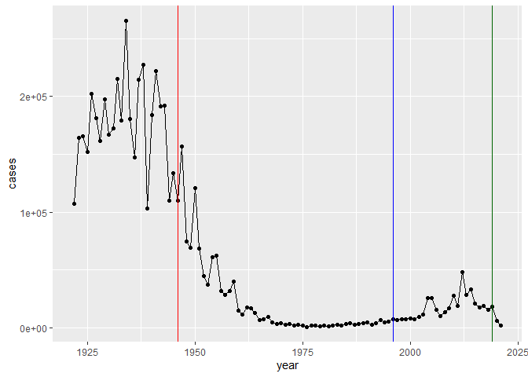

# Class 19: Pertussis Mini Project
Clarissa Savko (PID: A69028482)

Pertussis is a bacterial infection that causes a severe cough known as
“whooping cough”.

Let’s have a look at case numbers of Pertussis in the US.

We can find the case numbers on the \[CDC website\]
https://www.cdc.gov/pertussis/surv-reporting/cases-by-year.html

Q1. With the help of the R “addin” package datapasta assign the CDC
pertussis case number data to a data frame called cdc and use ggplot to
make a plot of cases numbers over time.

``` r
library(tidyverse)
```

    Warning: package 'tidyverse' was built under R version 4.3.2

    Warning: package 'readr' was built under R version 4.3.2

    Warning: package 'forcats' was built under R version 4.3.2

    Warning: package 'lubridate' was built under R version 4.3.2

    ── Attaching core tidyverse packages ──────────────────────── tidyverse 2.0.0 ──
    ✔ dplyr     1.1.3     ✔ readr     2.1.4
    ✔ forcats   1.0.0     ✔ stringr   1.5.1
    ✔ ggplot2   3.4.4     ✔ tibble    3.2.1
    ✔ lubridate 1.9.3     ✔ tidyr     1.3.0
    ✔ purrr     1.0.2     
    ── Conflicts ────────────────────────────────────────── tidyverse_conflicts() ──
    ✖ dplyr::filter() masks stats::filter()
    ✖ dplyr::lag()    masks stats::lag()
    ℹ Use the conflicted package (<http://conflicted.r-lib.org/>) to force all conflicts to become errors

``` r
ggplot(cdc, aes(year, cases)) +
         geom_point() +
         geom_line()
```


Q2. Using the ggplot geom_vline() function add lines to your previous
plot for the 1946 introduction of the wP vaccine and the 1996 switch to
aP vaccine (see example in the hint below). What do you notice?

``` r
ggplot(cdc) +
  aes( x = year, y= cases) +
  geom_point() +
  geom_line()+
  geom_vline(xintercept = 1946, color= "red")+
  geom_vline(xintercept = 1996, color= "blue")+
  geom_vline(xintercept = 2019, color= "darkgreen")
```



Q3. Describe what happened after the introduction of the aP vaccine? Do
you have a possible explanation for the observed trend?

There was an initial lag period for the first few years, than an
increase in cases in the 2010’s.

# CMI-PB Project

The CMI PB project collects and makes available data on the immune
response to Pertussis booster vaccination. We will access this data via
API. We will use the **jsonlite** package to access the data using the
`read_json()` function.

``` r
library(jsonlite)
```

    Warning: package 'jsonlite' was built under R version 4.3.2


    Attaching package: 'jsonlite'

    The following object is masked from 'package:purrr':

        flatten

``` r
subject <- read_json("https://cmi-pb.org/api/subject", simplifyVector = TRUE)
head(subject)
```

      subject_id infancy_vac biological_sex              ethnicity  race
    1          1          wP         Female Not Hispanic or Latino White
    2          2          wP         Female Not Hispanic or Latino White
    3          3          wP         Female                Unknown White
    4          4          wP           Male Not Hispanic or Latino Asian
    5          5          wP           Male Not Hispanic or Latino Asian
    6          6          wP         Female Not Hispanic or Latino White
      year_of_birth date_of_boost      dataset
    1    1986-01-01    2016-09-12 2020_dataset
    2    1968-01-01    2019-01-28 2020_dataset
    3    1983-01-01    2016-10-10 2020_dataset
    4    1988-01-01    2016-08-29 2020_dataset
    5    1991-01-01    2016-08-29 2020_dataset
    6    1988-01-01    2016-10-10 2020_dataset

``` r
nrow(subject)
```

    [1] 118

Q4. How many aP and wP infancy vaccinated subjects are in the dataset?

``` r
table(subject$infancy_vac)
```


    aP wP 
    60 58 

60 aP and 58 wP subjects.

Q5. How many Male and Female subjects/patients are in the dataset?

``` r
table(subject$biological_sex)
```


    Female   Male 
        79     39 

There are 79 females and 39 males.

Q6. What is the breakdown of race and biological sex (e.g. number of
Asian females, White males etc…)?

``` r
table(subject$race, subject$biological_sex)
```

                                               
                                                Female Male
      American Indian/Alaska Native                  0    1
      Asian                                         21   11
      Black or African American                      2    0
      More Than One Race                             9    2
      Native Hawaiian or Other Pacific Islander      1    1
      Unknown or Not Reported                       11    4
      White                                         35   20

There are several underrepresented groups including American Indians and
Black.

``` r
time_length(today() - mdy("11-26-1997"), "years")
```

    [1] 26.03696

Q7. Using this approach determine (i) the average age of wP individuals,
(ii) the average age of aP individuals; and (iii) are they significantly
different?

Q8. Determine the age of all individuals at time of boost?

``` r
subject$age <- ymd(subject$date_of_boost) - ymd(subject$year_of_birth)
subject$age_years <- time_length(subject$age, "years")
subject$age_years
```

      [1] 30.69678 51.07461 33.77413 28.65982 25.65914 28.77481 35.84942 34.14921
      [9] 20.56400 34.56263 30.65845 34.56263 19.56194 23.61944 27.61944 29.56331
     [17] 36.69815 19.65777 22.73511 35.65777 33.65914 31.65777 25.73580 24.70089
     [25] 28.70089 33.73580 19.73443 34.73511 19.73443 28.73648 27.73443 19.81109
     [33] 26.77344 33.81246 25.77413 19.81109 18.85010 19.81109 31.81109 22.81177
     [41] 31.84942 19.84942 18.85010 18.85010 19.90691 18.85010 20.90897 19.04449
     [49] 20.04381 19.90691 19.90691 19.00616 19.00616 20.04381 20.04381 20.07940
     [57] 21.08145 20.07940 20.07940 20.07940 32.26557 25.90007 23.90144 25.90007
     [65] 28.91992 42.92129 47.07461 47.07461 29.07324 21.07324 21.07324 28.15058
     [73] 24.15058 24.15058 21.14990 21.14990 31.20876 26.20671 32.20808 27.20876
     [81] 26.20671 21.20739 20.26557 22.26420 19.32375 21.32238 19.32375 19.32375
     [89] 22.41752 20.41889 21.41821 19.47707 23.47707 20.47639 21.47570 19.47707
     [97] 35.90965 28.73648 22.68309 20.83231 18.83368 18.83368 27.68241 32.68172
    [105] 27.68241 25.68378 23.68241 26.73785 32.73648 24.73648 25.79603 25.79603
    [113] 25.79603 31.79466 19.83299 21.91102 27.90965 24.06297

Q9. With the help of a faceted boxplot or histogram (see below), do you
think these two groups are significantly different?

``` r
ggplot(subject) +
  aes(age_years,
      fill=infancy_vac) +
  facet_wrap(vars(infancy_vac), ncol=1)+
  geom_histogram()
```

    `stat_bin()` using `bins = 30`. Pick better value with `binwidth`.


``` r
specimen <- (read_json("https://www.cmi-pb.org/api/specimen", simplifyVector =TRUE))
head(specimen)
```

      specimen_id subject_id actual_day_relative_to_boost
    1           1          1                           -3
    2           2          1                            1
    3           3          1                            3
    4           4          1                            7
    5           5          1                           11
    6           6          1                           32
      planned_day_relative_to_boost specimen_type visit
    1                             0         Blood     1
    2                             1         Blood     2
    3                             3         Blood     3
    4                             7         Blood     4
    5                            14         Blood     5
    6                            30         Blood     6

``` r
titer <- (read_json("https://www.cmi-pb.org/api/v4/plasma_ab_titer", simplifyVector = TRUE))
head(titer)
```

      specimen_id isotype is_antigen_specific antigen        MFI MFI_normalised
    1           1     IgE               FALSE   Total 1110.21154       2.493425
    2           1     IgE               FALSE   Total 2708.91616       2.493425
    3           1     IgG                TRUE      PT   68.56614       3.736992
    4           1     IgG                TRUE     PRN  332.12718       2.602350
    5           1     IgG                TRUE     FHA 1887.12263      34.050956
    6           1     IgE                TRUE     ACT    0.10000       1.000000
       unit lower_limit_of_detection
    1 UG/ML                 2.096133
    2 IU/ML                29.170000
    3 IU/ML                 0.530000
    4 IU/ML                 6.205949
    5 IU/ML                 4.679535
    6 IU/ML                 2.816431

I want to merge (join) the specimen and subject tables together.

Q9. Complete the code to join specimen and subject tables to make a new
merged data frame containing all specimen records along with their
associated subject details:

``` r
meta <- inner_join(specimen, subject)
```

    Joining with `by = join_by(subject_id)`

``` r
dim(meta)
```

    [1] 939  15

``` r
head(meta)
```

      specimen_id subject_id actual_day_relative_to_boost
    1           1          1                           -3
    2           2          1                            1
    3           3          1                            3
    4           4          1                            7
    5           5          1                           11
    6           6          1                           32
      planned_day_relative_to_boost specimen_type visit infancy_vac biological_sex
    1                             0         Blood     1          wP         Female
    2                             1         Blood     2          wP         Female
    3                             3         Blood     3          wP         Female
    4                             7         Blood     4          wP         Female
    5                            14         Blood     5          wP         Female
    6                            30         Blood     6          wP         Female
                   ethnicity  race year_of_birth date_of_boost      dataset
    1 Not Hispanic or Latino White    1986-01-01    2016-09-12 2020_dataset
    2 Not Hispanic or Latino White    1986-01-01    2016-09-12 2020_dataset
    3 Not Hispanic or Latino White    1986-01-01    2016-09-12 2020_dataset
    4 Not Hispanic or Latino White    1986-01-01    2016-09-12 2020_dataset
    5 Not Hispanic or Latino White    1986-01-01    2016-09-12 2020_dataset
    6 Not Hispanic or Latino White    1986-01-01    2016-09-12 2020_dataset
             age age_years
    1 11212 days  30.69678
    2 11212 days  30.69678
    3 11212 days  30.69678
    4 11212 days  30.69678
    5 11212 days  30.69678
    6 11212 days  30.69678

Now I want to merge the titer table with the meta table.

Q10. Now using the same procedure join meta with titer data so we can
further analyze this data in terms of time of visit aP/wP, male/female
etc.

``` r
abdata <- inner_join(titer, meta)
```

    Joining with `by = join_by(specimen_id)`

``` r
dim(abdata)
```

    [1] 41810    22

Q11. How many specimens (i.e. entries in abdata) do we have for each
isotype?

Q12. What are the different \$dataset values in abdata and what do you
notice about the number of rows for the most “recent” dataset?

Q13. Complete the following code to make a summary boxplot of Ab titer
levels (MFI) for all antigens:

``` r
igg <- abdata %>% filter(isotype == "IgG")
```

``` r
ggplot(igg) + aes(MFI_normalised,
                  antigen) +
  geom_boxplot()
```


``` r
ggplot(igg) +
  aes(MFI_normalised, antigen) +
  geom_boxplot() + 
    xlim(0,75) +
  facet_wrap(vars(visit), nrow=2)
```

    Warning: Removed 5 rows containing non-finite values (`stat_boxplot()`).


Q14. What antigens show differences in the level of IgG antibody titers
recognizing them over time? Why these and not others?

``` r
ggplot(igg) +
  aes(MFI_normalised, antigen, col=infancy_vac ) +
  geom_boxplot(show.legend = FALSE) + 
  facet_wrap(vars(visit), nrow=2) +
  xlim(0,75) +
  theme_bw()
```

    Warning: Removed 5 rows containing non-finite values (`stat_boxplot()`).


``` r
oops <- abdata %>% filter(antigen=="Fim2/3")
table(oops$dataset)
```

    < table of extent 0 >

``` r
table(abdata$dataset)
```


    2020_dataset 2021_dataset 2022_dataset 
           31520         8085         2205 

Select (or filter) for the 2021 dataset and isotype IgG

I want a time course of (`planned_day_relative_to_boost`) of IgG levels
(`MFI_normalised`) for “PT” antigen.

``` r
igpt.21 <- abdata %>% filter (dataset== "2021_dataset", 
                   isotype == "IgG", 
                   antigen == "PT")
```

``` r
ggplot(igpt.21) +
  aes(x = planned_day_relative_to_boost, 
      y = MFI_normalised,
      col = infancy_vac) +
  geom_point()+
  geom_line(aes(group = igpt.21$subject_id), linewidth=0.5, alpha=0.5) +
  geom_smooth(se=FALSE, span = 0.4, linewidth=3)
```

    Warning: Use of `igpt.21$subject_id` is discouraged.
    ℹ Use `subject_id` instead.

    `geom_smooth()` using method = 'loess' and formula = 'y ~ x'

    Warning in simpleLoess(y, x, w, span, degree = degree, parametric = parametric,
    : pseudoinverse used at -0.6

    Warning in simpleLoess(y, x, w, span, degree = degree, parametric = parametric,
    : neighborhood radius 3.6

    Warning in simpleLoess(y, x, w, span, degree = degree, parametric = parametric,
    : reciprocal condition number 1.8382e-16

    Warning in simpleLoess(y, x, w, span, degree = degree, parametric = parametric,
    : There are other near singularities as well. 11364

    Warning in simpleLoess(y, x, w, span, degree = degree, parametric = parametric,
    : pseudoinverse used at -0.6

    Warning in simpleLoess(y, x, w, span, degree = degree, parametric = parametric,
    : neighborhood radius 3.6

    Warning in simpleLoess(y, x, w, span, degree = degree, parametric = parametric,
    : reciprocal condition number 1.4316e-16

    Warning in simpleLoess(y, x, w, span, degree = degree, parametric = parametric,
    : There are other near singularities as well. 11364


What about the 2022 dataset?

``` r
igpt.22 <- abdata %>% filter (dataset== "2022_dataset", 
                   isotype == "IgG", 
                   antigen == "PT")
```

``` r
ggplot(igpt.22) +
  aes(x = planned_day_relative_to_boost, 
      y = MFI_normalised,
      col = infancy_vac) +
  geom_point()+
  geom_line(aes(group = igpt.22$subject_id), linewidth=0.5, alpha=0.5) +
  geom_smooth(se=FALSE, span = 0.4, linewidth=3)
```

    Warning: Use of `igpt.22$subject_id` is discouraged.
    ℹ Use `subject_id` instead.

    `geom_smooth()` using method = 'loess' and formula = 'y ~ x'

    Warning in simpleLoess(y, x, w, span, degree = degree, parametric = parametric,
    : pseudoinverse used at -30.15

    Warning in simpleLoess(y, x, w, span, degree = degree, parametric = parametric,
    : neighborhood radius 15.15

    Warning in simpleLoess(y, x, w, span, degree = degree, parametric = parametric,
    : reciprocal condition number 0

    Warning in simpleLoess(y, x, w, span, degree = degree, parametric = parametric,
    : There are other near singularities as well. 229.52

    Warning in simpleLoess(y, x, w, span, degree = degree, parametric = parametric,
    : pseudoinverse used at -30.15

    Warning in simpleLoess(y, x, w, span, degree = degree, parametric = parametric,
    : neighborhood radius 15.15

    Warning in simpleLoess(y, x, w, span, degree = degree, parametric = parametric,
    : reciprocal condition number 0

    Warning in simpleLoess(y, x, w, span, degree = degree, parametric = parametric,
    : There are other near singularities as well. 229.52


