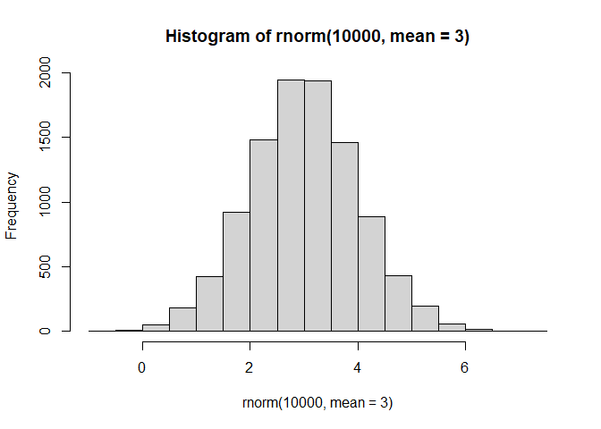
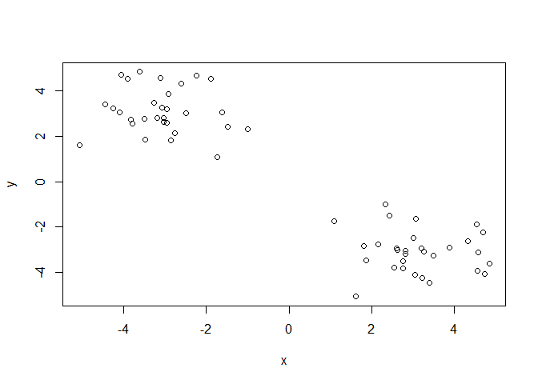
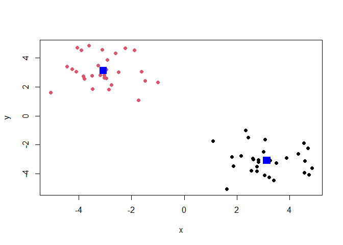
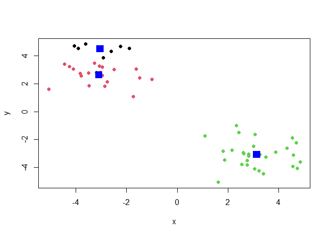
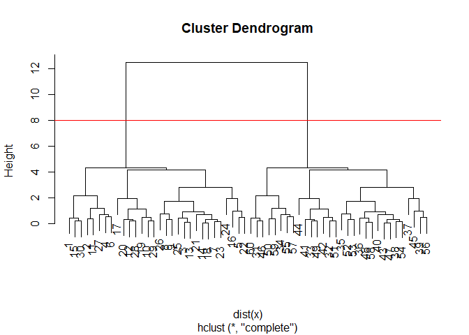
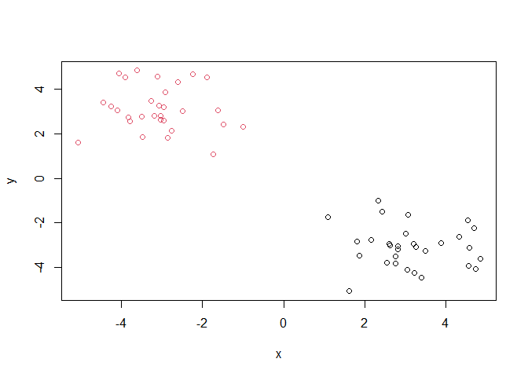
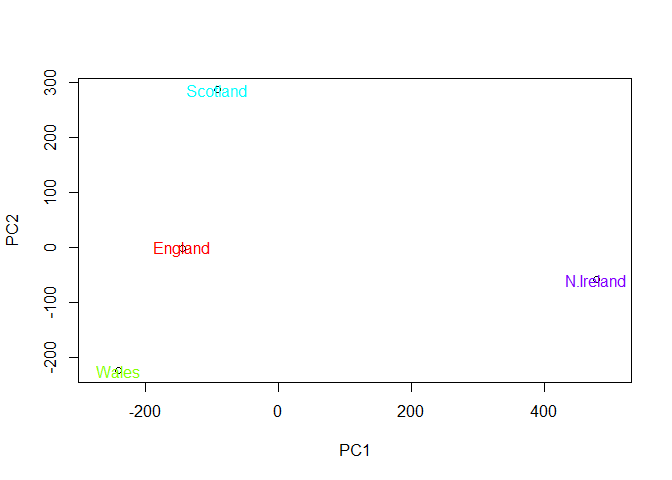
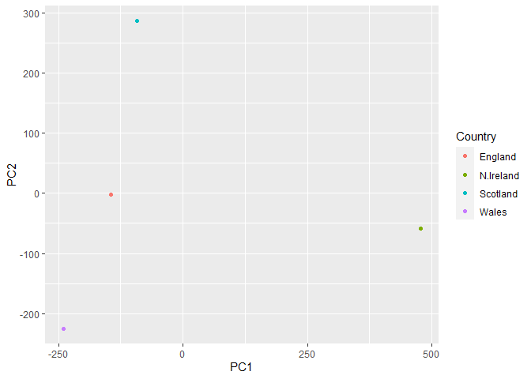
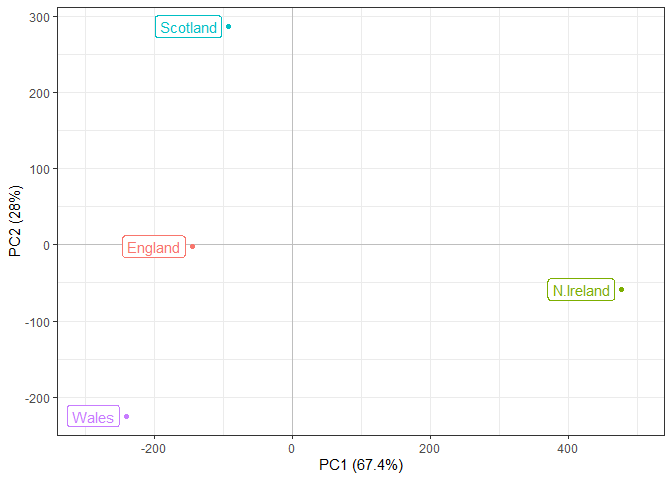
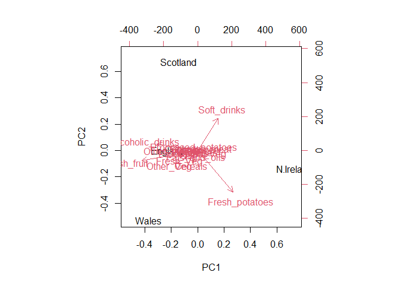

# Class 7: Machine Learning
Clarissa Savko (PID:A69028482)

# Clustering

We will start with k-means clustering, one of the most prevalent of all
clustering methods.

To get started let’s make some data up:

``` r
hist(rnorm(10000, mean=3))
```



``` r
tmp <- c(rnorm(30,3), rnorm(30, -3))
x <- cbind(x=tmp, y=rev(tmp))
x
```

                  x         y
     [1,]  4.848075 -3.618665
     [2,]  4.691244 -2.243131
     [3,]  3.257519 -3.070920
     [4,]  4.334016 -2.616447
     [5,]  2.428553 -1.480773
     [6,]  3.881228 -2.913441
     [7,]  2.815510 -3.046432
     [8,]  2.154025 -2.770067
     [9,]  1.819349 -2.854114
    [10,]  3.053436 -4.103029
    [11,]  4.534765 -1.897799
    [12,]  2.756077 -3.839037
    [13,]  3.207225 -2.958139
    [14,]  2.632511 -3.034249
    [15,]  4.562678 -3.918159
    [16,]  3.073017 -1.621709
    [17,]  1.608389 -5.078690
    [18,]  2.607937 -2.956663
    [19,]  3.407633 -4.448961
    [20,]  2.764453 -3.498756
    [21,]  3.020533 -2.499923
    [22,]  2.332945 -1.001058
    [23,]  2.810937 -3.201855
    [24,]  1.100372 -1.744557
    [25,]  3.487389 -3.271240
    [26,]  1.863100 -3.479600
    [27,]  4.583826 -3.113970
    [28,]  2.556206 -3.789907
    [29,]  3.228226 -4.254086
    [30,]  4.731177 -4.071601
    [31,] -4.071601  4.731177
    [32,] -4.254086  3.228226
    [33,] -3.789907  2.556206
    [34,] -3.113970  4.583826
    [35,] -3.479600  1.863100
    [36,] -3.271240  3.487389
    [37,] -1.744557  1.100372
    [38,] -3.201855  2.810937
    [39,] -1.001058  2.332945
    [40,] -2.499923  3.020533
    [41,] -3.498756  2.764453
    [42,] -4.448961  3.407633
    [43,] -2.956663  2.607937
    [44,] -5.078690  1.608389
    [45,] -1.621709  3.073017
    [46,] -3.918159  4.562678
    [47,] -3.034249  2.632511
    [48,] -2.958139  3.207225
    [49,] -3.839037  2.756077
    [50,] -1.897799  4.534765
    [51,] -4.103029  3.053436
    [52,] -2.854114  1.819349
    [53,] -2.770067  2.154025
    [54,] -3.046432  2.815510
    [55,] -2.913441  3.881228
    [56,] -1.480773  2.428553
    [57,] -2.616447  4.334016
    [58,] -3.070920  3.257519
    [59,] -2.243131  4.691244
    [60,] -3.618665  4.848075

``` r
plot(x)
```



The main function in R for k-means clustering is called ‘kmeans()’.

``` r
k <- kmeans(x, centers=2, nstart=20)
k
```

    K-means clustering with 2 clusters of sizes 30, 30

    Cluster means:
              x         y
    1  3.138412 -3.079899
    2 -3.079899  3.138412

    Clustering vector:
     [1] 1 1 1 1 1 1 1 1 1 1 1 1 1 1 1 1 1 1 1 1 1 1 1 1 1 1 1 1 1 1 2 2 2 2 2 2 2 2
    [39] 2 2 2 2 2 2 2 2 2 2 2 2 2 2 2 2 2 2 2 2 2 2

    Within cluster sum of squares by cluster:
    [1] 54.90764 54.90764
     (between_SS / total_SS =  91.4 %)

    Available components:

    [1] "cluster"      "centers"      "totss"        "withinss"     "tot.withinss"
    [6] "betweenss"    "size"         "iter"         "ifault"      

Q1. How many points are in each cluster

``` r
k$size
```

    [1] 30 30

Q2.The clustering result i.e.membership vector?

``` r
k$cluster
```

     [1] 1 1 1 1 1 1 1 1 1 1 1 1 1 1 1 1 1 1 1 1 1 1 1 1 1 1 1 1 1 1 2 2 2 2 2 2 2 2
    [39] 2 2 2 2 2 2 2 2 2 2 2 2 2 2 2 2 2 2 2 2 2 2

Q3. Cluster centers

``` r
k$centers
```

              x         y
    1  3.138412 -3.079899
    2 -3.079899  3.138412

Q4. Make a plot of our data colored by clustering results with
optionally the cluster centers shown.

``` r
plot(x, col=k$cluster, pch=16)
points(k$centers, col="blue", pch=15, cex=2)
```



Q5. Run kmeans again except with 3 groups rather than 2 and plot the
results.

``` r
k3 <- kmeans(x, centers=3, nstart=20)
k3
```

    K-means clustering with 3 clusters of sizes 8, 22, 30

    Cluster means:
              x         y
    1 -3.049152  4.520876
    2 -3.091080  2.635697
    3  3.138412 -3.079899

    Clustering vector:
     [1] 3 3 3 3 3 3 3 3 3 3 3 3 3 3 3 3 3 3 3 3 3 3 3 3 3 3 3 3 3 3 1 2 2 1 2 2 2 2
    [39] 2 2 2 2 2 2 2 1 2 2 2 1 2 2 2 2 1 2 1 2 1 1

    Within cluster sum of squares by cluster:
    [1]  4.940334 29.107447 54.907635
     (between_SS / total_SS =  93.0 %)

    Available components:

    [1] "cluster"      "centers"      "totss"        "withinss"     "tot.withinss"
    [6] "betweenss"    "size"         "iter"         "ifault"      

``` r
plot(x, col=k3$cluster, pch=16)
points(k3$centers, col="blue", pch=15, cex=2)
```



# Hierarchical Clustering has an advantage in that it can reveal the structure in your data rather than imposing a structure as k means will.

The main function for this in “base” R is called `hclust()`

It requires a distance matrix as input, not the raw data itself

``` r
hc <- hclust( dist(x) )
hc
```


    Call:
    hclust(d = dist(x))

    Cluster method   : complete 
    Distance         : euclidean 
    Number of objects: 60 

``` r
plot(hc)
abline(h=8, col= "red")
```



The function to get our clusters/groups from a hclust object is called
`cutree()`

``` r
groups <- cutree(hc, h=8)
```

Q. Plot our hclust results in terms of our data colored by cluster
membership.

``` r
plot(x, col= groups)
```



# Principal Component Analysis (PCA)

We will work on data from the UK about the strange stuff folks there
eat. It has 17 different foods for 4 countries.

``` r
url <- "https://tinyurl.com/UK-foods"
data <- read.csv(url)
head(data)
```

                   X England Wales Scotland N.Ireland
    1         Cheese     105   103      103        66
    2  Carcass_meat      245   227      242       267
    3    Other_meat      685   803      750       586
    4           Fish     147   160      122        93
    5 Fats_and_oils      193   235      184       209
    6         Sugars     156   175      147       139

This risks losing data if you run the code multiple times and lose
columns.

``` r
rownames(data) <- data[,1]
data <- data[,-1]
head(data)
```

                   England Wales Scotland N.Ireland
    Cheese             105   103      103        66
    Carcass_meat       245   227      242       267
    Other_meat         685   803      750       586
    Fish               147   160      122        93
    Fats_and_oils      193   235      184       209
    Sugars             156   175      147       139

``` r
data <- read.csv(url,row.names=1)
head(data)
```

                   England Wales Scotland N.Ireland
    Cheese             105   103      103        66
    Carcass_meat       245   227      242       267
    Other_meat         685   803      750       586
    Fish               147   160      122        93
    Fats_and_oils      193   235      184       209
    Sugars             156   175      147       139

``` r
dim(data)
```

    [1] 17  4

17 rows and 4 columns.

``` r
barplot(as.matrix(data), beside=T, col=rainbow(nrow(data)))
```


``` r
pairs(data, col=rainbow(10), pch=16)
```


Most of the points for the graphs comparing to North Ireland are in the
bottom left corner and then there are just two points in the top right
corner.

# PCA to the rescue

Help me make sense of this data. The main function for PCA in base R is
called `prcomp`

It wants the transpose (`t()`) of our food data for analysis.

``` r
pca <- prcomp(t(data))
summary(pca)
```

    Importance of components:
                                PC1      PC2      PC3       PC4
    Standard deviation     324.1502 212.7478 73.87622 3.176e-14
    Proportion of Variance   0.6744   0.2905  0.03503 0.000e+00
    Cumulative Proportion    0.6744   0.9650  1.00000 1.000e+00

One of the main results that folks look for is called the “score plot”
aka PC plot, PC1 vs PC2 plot

``` r
plot(pca$x[,1], pca$x[,2],xlab="PC1", ylab="PC2", xlim=c(-270,500))
text(pca$x[,1], pca$x[,2], colnames(data), col=rainbow(4))
```



``` r
v <- round( pca$sdev^2/sum(pca$sdev^2) * 100 )
v
```

    [1] 67 29  4  0

``` r
z <- summary(pca)
z$importance
```

                                 PC1       PC2      PC3          PC4
    Standard deviation     324.15019 212.74780 73.87622 3.175833e-14
    Proportion of Variance   0.67444   0.29052  0.03503 0.000000e+00
    Cumulative Proportion    0.67444   0.96497  1.00000 1.000000e+00

``` r
barplot(v, xlab="Principal Component", ylab="Percent Variation")
```


``` r
par(mar=c(10, 3, 0.35, 0))
barplot( pca$rotation[,1], las=2 )
```


``` r
par(mar=c(10, 3, 0.35, 0))
barplot( pca$rotation[,2], las=2 )
```


``` r
pca$rotation
```

                                 PC1          PC2         PC3          PC4
    Cheese              -0.056955380  0.016012850  0.02394295 -0.694538519
    Carcass_meat         0.047927628  0.013915823  0.06367111  0.489884628
    Other_meat          -0.258916658 -0.015331138 -0.55384854  0.279023718
    Fish                -0.084414983 -0.050754947  0.03906481 -0.008483145
    Fats_and_oils       -0.005193623 -0.095388656 -0.12522257  0.076097502
    Sugars              -0.037620983 -0.043021699 -0.03605745  0.034101334
    Fresh_potatoes       0.401402060 -0.715017078 -0.20668248 -0.090972715
    Fresh_Veg           -0.151849942 -0.144900268  0.21382237 -0.039901917
    Other_Veg           -0.243593729 -0.225450923 -0.05332841  0.016719075
    Processed_potatoes  -0.026886233  0.042850761 -0.07364902  0.030125166
    Processed_Veg       -0.036488269 -0.045451802  0.05289191 -0.013969507
    Fresh_fruit         -0.632640898 -0.177740743  0.40012865  0.184072217
    Cereals             -0.047702858 -0.212599678 -0.35884921  0.191926714
    Beverages           -0.026187756 -0.030560542 -0.04135860  0.004831876
    Soft_drinks          0.232244140  0.555124311 -0.16942648  0.103508492
    Alcoholic_drinks    -0.463968168  0.113536523 -0.49858320 -0.316290619
    Confectionery       -0.029650201  0.005949921 -0.05232164  0.001847469

``` r
library(ggplot2)
df <- as.data.frame(pca$x)
df_lab <- tibble::rownames_to_column(df, "Country")

# Our first basic plot
ggplot(df_lab) + 
  aes(PC1, PC2, col=Country) + 
  geom_point()
```



``` r
ggplot(df_lab) + 
  aes(PC1, PC2, col=Country, label=Country) + 
  geom_hline(yintercept = 0, col="gray") +
  geom_vline(xintercept = 0, col="gray") +
  geom_point(show.legend = FALSE) +
  geom_label(hjust=1, nudge_x = -10, show.legend = FALSE) +
  expand_limits(x = c(-300,500)) +
  xlab("PC1 (67.4%)") +
  ylab("PC2 (28%)") +
  theme_bw()
```



``` r
ld <- as.data.frame(pca$rotation)
ld_lab <- tibble::rownames_to_column(ld, "Food")

ggplot(ld_lab) +
  aes(PC1, Food) +
  geom_col() 
```


``` r
ggplot(ld_lab) +
  aes(PC1, reorder(Food, PC1), bg=PC1) +
  geom_col() + 
  xlab("PC1 Loadings/Contributions") +
  ylab("Food Group") +
  scale_fill_gradient2(low="purple", mid="gray", high="darkgreen", guide=NULL) +
  theme_bw()
```


``` r
biplot(pca)
```



``` r
url2 <- "https://tinyurl.com/expression-CSV"
rna.data <- read.csv(url2, row.names=1)
head(rna.data)
```

           wt1 wt2  wt3  wt4 wt5 ko1 ko2 ko3 ko4 ko5
    gene1  439 458  408  429 420  90  88  86  90  93
    gene2  219 200  204  210 187 427 423 434 433 426
    gene3 1006 989 1030 1017 973 252 237 238 226 210
    gene4  783 792  829  856 760 849 856 835 885 894
    gene5  181 249  204  244 225 277 305 272 270 279
    gene6  460 502  491  491 493 612 594 577 618 638

``` r
dim(rna.data)
```

    [1] 100  10

100 genes, 10 samples
