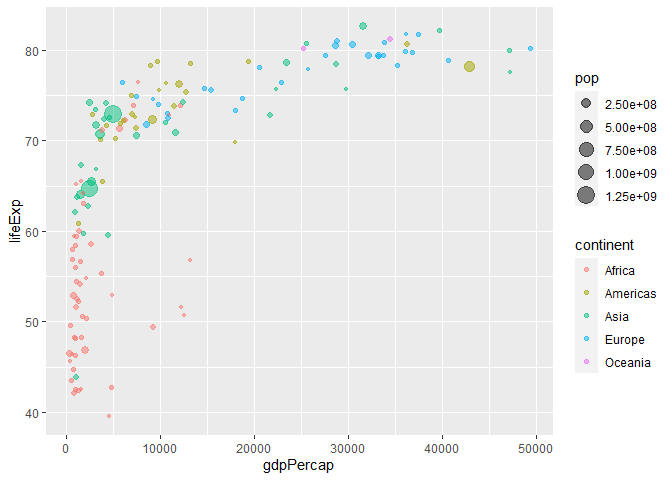

# Class 5: Data Visualization with ggplot
Clarissa (PID: A69028482)

## 

Use the function “install.packages()” to install ggplot2 Before I use
any package, I have to load them with “library()” call like so:

``` r
#install.packages("ggplot2")
library(ggplot2)
#ggplot(cars)
```

## 

Use “head()” as good practice to only render the first 6 rows

``` r
head(cars)
```

      speed dist
    1     4    2
    2     4   10
    3     7    4
    4     7   22
    5     8   16
    6     9   10

## 

There is always the “base R” graphics system, i.e. “plot()”

``` r
plot(cars)
```


## To use ggplot I need to spell out at least 3 things:

-data (stuff you want to plot) -aesthetics (aes() values- how the data
map to the plot) -geometries (geoms- how I want things drawn)

``` r
ggplot(cars) +
  aes(x=speed, y=dist) +
  geom_point()
```


``` r
ggplot(cars) + 
  aes(x=speed, y=dist) + 
  geom_point() +
  labs(title= "Speed and Stopping Distance of Cars", 
       x= "Speed (MPH)",
       y= "Stopping Distance (ft)",
       subtitle= "Ancient Data for Ancient Cars",
       caption= "Dataset: 'cars'") +
  geom_smooth(method="lm", se=FALSE) +
  theme_bw()
```

    `geom_smooth()` using formula = 'y ~ x'


``` r
url <- "https://bioboot.github.io/bimm143_S20/class-material/up_down_expression.txt"
genes <- read.delim(url)
head(genes)
```

            Gene Condition1 Condition2      State
    1      A4GNT -3.6808610 -3.4401355 unchanging
    2       AAAS  4.5479580  4.3864126 unchanging
    3      AASDH  3.7190695  3.4787276 unchanging
    4       AATF  5.0784720  5.0151916 unchanging
    5       AATK  0.4711421  0.5598642 unchanging
    6 AB015752.4 -3.6808610 -3.5921390 unchanging

``` r
nrow(genes)
```

    [1] 5196

``` r
colnames(genes)
```

    [1] "Gene"       "Condition1" "Condition2" "State"     

``` r
ncol(genes)
```

    [1] 4

``` r
table(genes$State)
```


          down unchanging         up 
            72       4997        127 

``` r
round(table(genes$State)/nrow(genes) * 100 , 2)
```


          down unchanging         up 
          1.39      96.17       2.44 

``` r
sum(genes$State == "up")
```

    [1] 127

There are 5196 genes in this very serious dataset. The names of the
columns in this dataset are Gene, Condition1, Condition2, State . There
are 4 columns in this data set. There are 127 upregulated genes in this
dataset.

``` r
ggplot(genes) +
  aes(x=Condition1, y=Condition2) +
  geom_point()
```


``` r
p <- ggplot(genes) +
  aes(x=Condition1, y=Condition2, col=State) +
  geom_point()
```

``` r
p <- ggplot(genes) +
  aes(x=Condition1, y=Condition2, col=State) +
  geom_point()
p + scale_colour_manual(values=c("blue", "gray", "red")) 
```


``` r
p + scale_colour_manual(values=c("blue", "gray", "red")) + labs(title= "Gene Expression Changes Upon Drug Treatment", 
       x= "Control (no drug)",
       y= "Drug Treatment")
```


## Section 7: gapminder

``` r
url <- "https://raw.githubusercontent.com/jennybc/gapminder/master/inst/extdata/gapminder.tsv"

gapminder <- read.delim(url)
```

``` r
library("dplyr")
```


    Attaching package: 'dplyr'

    The following objects are masked from 'package:stats':

        filter, lag

    The following objects are masked from 'package:base':

        intersect, setdiff, setequal, union

``` r
gapminder_2007 <- gapminder %>% filter(year==2007)
```

``` r
ggplot(gapminder_2007) +
  aes(x=gdpPercap, y=lifeExp, color=continent, size=pop) + geom_point(alpha=0.5)
```



``` r
ggplot(gapminder_2007) +
  aes(x=gdpPercap, y=lifeExp, color=pop) + geom_point(alpha=0.8)
```


``` r
ggplot(gapminder_2007) +
  aes(x=gdpPercap, y=lifeExp, size = pop) + geom_point(alpha=0.5)
```


``` r
ggplot(gapminder_2007) + 
  geom_point(aes(x=gdpPercap, y= lifeExp,
                 size= pop), alpha= 0.5) + 
  scale_size_area(max_size = 10)
```


``` r
library("dplyr")
gapminder_1957 <- gapminder %>% filter(year==1957)
ggplot(gapminder_1957) +
  geom_point(aes(x=gdpPercap, y=lifeExp, 
                 color = continent, size = pop), alpha=0.7) +
                   scale_size_area(max_size = 15)
```


``` r
gapminder_1957 <- gapminder%>% filter(year==1957 | year==2007)

ggplot(gapminder_1957) +
  geom_point(aes(x= gdpPercap, y=lifeExp, color= continent, size = pop), alpha=0.7) +
  scale_size_area(max_size = 10) + 
  facet_wrap(~year)
```


``` r
ggplot(mtcars) + 
  aes(x=mpg, y=disp) + 
  geom_point()
```


``` r
ggplot(mtcars, aes(mpg, disp)) +
  geom_point()
```


